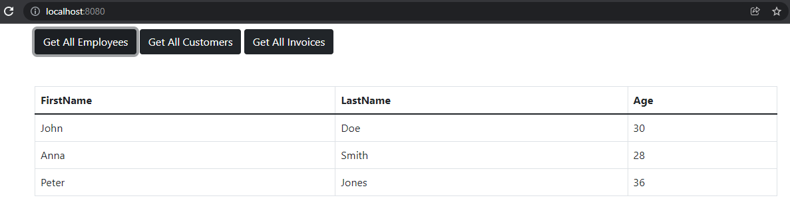
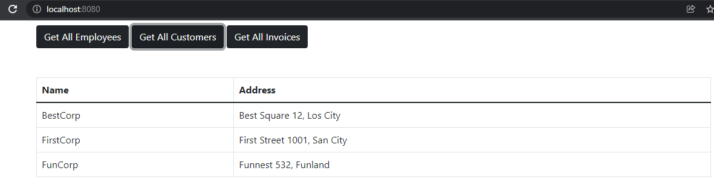
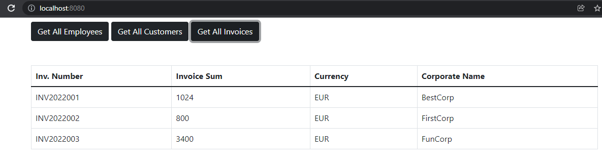

# interview-assignment

---

## Technologies

A little bit of what's inside the project:

- **Node.js** and **Express** to create the server and handle routes, requests and responses(Backend).
- **HTML, JavaScript and Boostrap** to create the frontend
- **Visual Studio Code** IDE

## Endpoints:

| Endpoints            | Description                             |
| -------------------- | --------------------------------------- |
| GET `/api/employees` | Return all employees from the Json file |
| GET `/api/customers` | Return all customers from the Json file |
| GET `/api/invoices`  | Return all invoices from the Json file  |

#### Example output(Backend):

- **Employees** `{"employees":[{"firstName":"John","lastName":"Doe","age":30},{"firstName":"Anna","lastName":"Smith","age":28},{"firstName":"Peter","lastName":"Jones","age":36}]}`
- **Customers** `{"customers":[{"corpName":"BestCorp","address":"Best Square 12, Los City"},{"corpName":"FirstCorp","address":"First Street 1001, San City"},{"corpName":"FunCorp","address":"Funnest 532, Funland"}]}`
- **Invoices** `{"invoices":[{"invNumber":"INV2022001","invSum":1024,"currency":"EUR","corpName":"BestCorp"},{"invNumber":"INV2022002","invSum":800,"currency":"EUR","corpName":"FirstCorp"},{"invNumber":"INV2022003","invSum":3400,"currency":"EUR","corpName":"FunCorp"}]}`

#### Example output(Frontend):

- **Get All Employees**
  

- **Get All Customers**
  

- **Get All Invoices**
  

## Requirements

- For development, you will only need Node.js and a node global package, installed in your environement.
- IDE used is Visual Studio Code editor and must have Live Server extension installed to be able to run the raw html file(in terms of giving it a port number orthewise it will be blocked by CORS policy)

### Node

- #### Node installation on Windows

  Just go on [official Node.js website](https://nodejs.org/) and download the installer.
  Also, be sure to have `git` available in your PATH, `npm` might need it (You can find git [here](https://git-scm.com/)).

- #### Node installation on Ubuntu

  You can install nodejs and npm easily with apt install, just run the following commands.

      $ sudo apt install nodejs
      $ sudo apt install npm

- #### Other Operating Systems
  You can find more information about the installation on the [official Node.js website](https://nodejs.org/) and the [official NPM website](https://npmjs.org/).

If the installation was successful, you should be able to run the following command.

    $ node --version
    v16.13.0

    $ npm --version
    8.1.0

###

---

- ## Getting Started
  $ git clone https://github.com/Moro-Afriyie/interview-assignment.git
  $ or you can download the zip file

##

---

## Install Dependencies for the backend

    $ cd backend (this is the only folder which had a package.json file in it)
    $ npm install

## Install Dependencies for the frontend in case you don't have live server extension installed on vscode

    $ cd frontend
    $ npm install http-server -g (this package is used to run the frontend files on localhost since i didn't use any frontend framework)

## Running the project

### Backend

    $ cd backend
    $ npm start
    $ Navigate to `http://localhost:5000`

### Frontend

    $ cd frontend
    $ http-server
    $ Navigate to `http://localhost:8080/`
